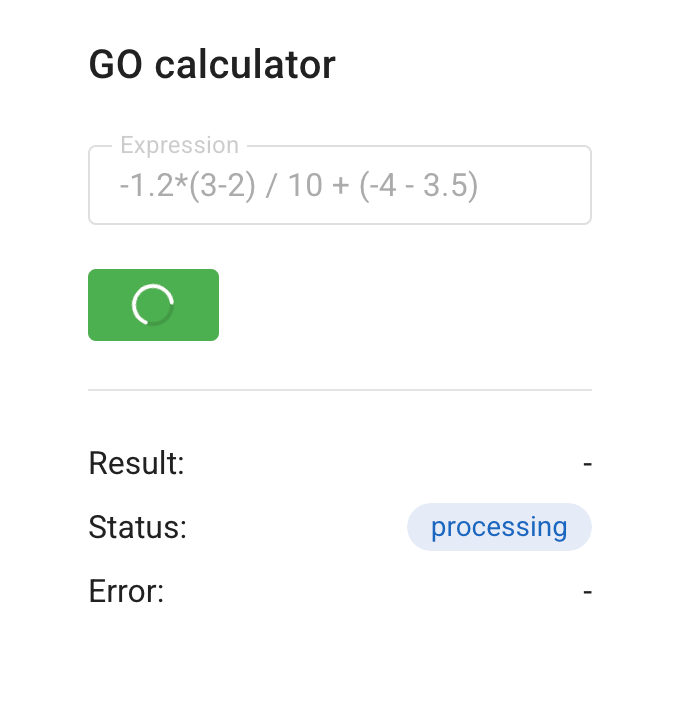

# GO-калькулятор

## Описание
GO-калькулятор — это веб-сервис для вычисления результата числового выражения, переданного пользователем.

Поддерживаемые операции:
- Сложение (`+`)
- Вычитание (`-`)
- Умножение (`*`)
- Деление (`/`)
- Приоритет операций с использованием скобок

## Сборка и запуск

Из корня проекта выполните команду:

```shell
docker-compose up
```

После сборки образов и запуска контейнеров интерфейс сервиса будет доступен по адресу http://127.0.0.1:8081

А бэкенд-часть приложения окажется развернута на http://127.0.0.1:8080

## Взаимодействие с сервисом

## Через интерфейс

После запуска docker-compose можно сразу начать взаимодействие с сервисом прямо из браузера. Результат вычисления, статус обработки и ошибки отображаются в реальном времени: 



Работает это так, что после отправки выражения на сервер и получения его ID, клиент периодически опрашивает бэкенд (так называемый long polling) и после каждого ответа обновляет информацию о выражении.

## Через curl

### Успешный запрос

#### Пример
```shell
curl --location '127.0.0.1:8080/api/v1/calculate' \
--header 'Content-Type: application/json' \
--data '{
  "expression": "(2+2)*2/2.5"
}'
```

#### Ответ (HTTP 201):
```json
{
  "id": 1
}
```

### Ошибка: невалидный JSON

#### Пример
```shell
curl --location '127.0.0.1:8080/api/v1/calculate' \
--header 'Content-Type: application/json' \
--data '{
  "exp
}'
```

#### Ответ (HTTP 500):
```json
{
  "error": "failed to parse request body: invalid character '\\n' in string literal"
}
```

### Ошибка: невалидное выражение

#### Пример
```shell
curl --location '127.0.0.1:8080/api/v1/calculate' \
--header 'Content-Type: application/json' \
--data '{
  "expression": "3 + a"
}'
```

#### Ответ (HTTP 422):
```json
{
  "error": "expression contains invalid token at position 5: а"
}
```

### Ошибка: не передан параметр "expression" или он пустой

#### Пример
```shell
curl --location '127.0.0.1:8080/api/v1/calculate' \
--header 'Content-Type: application/json' \
--data '{
  "exp": "4 + 2"
}'
```

#### Ответ (HTTP 400):
```json
{
  "error": "expression is empty"
}
```

### Ошибка: неверный HTTP-метод

#### Пример
```shell
curl --location '127.0.0.1:8080/api/v1/calculate' \
-X GET
--header 'Content-Type: application/json' \
--data '{
  "expression": "2 + 2"
}'
```

#### Ответ (HTTP 405):
```json
{
  "error": "expected one of the methods: POST"
}
```
## Настройка констант

Оркестратор берет значения констант из переменных окружения. Можно задать их отдельно перед запуском сервиса, но более простой вариант — отредактировать значения прямо в **docker-compose.yml**

```yaml
TIME_ADDITION_MS: 100
TIME_SUBTRACTION_MS: 100
TIME_MULTIPLICATIONS_MS: 100
TIME_DIVISIONS_MS: 100
TASK_MAX_PROCESS_TIME_IN_MS: 30000
```

Первые четыре отвечают за время выполнения базовых операций, а последняя — за общее максимальное время обработки агентом задачи, после чего оркестратор отказывается принимать ее результат.

Также при необходимости можно поменять порты бэкенд-сервиса и клиента, это все задается в том же **docker-compose.yml**

## Запуск тестов

Убедитесь, что находитесь в каталоге calculator_services. Затем запустите команду:
```shell
go test ./... 
```
