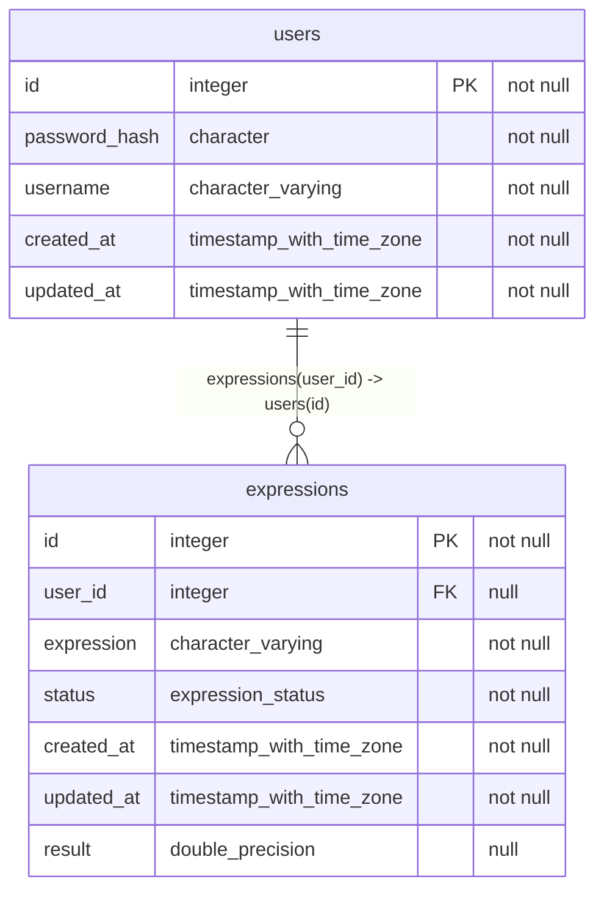

## Diagram

```mermaid
erDiagram

    expressions {
        id integer PK "not null"
        user_id integer FK "null"
        expression character_varying "not null"
        status expression_status "not null"
        created_at timestamp_with_time_zone "not null"
        updated_at timestamp_with_time_zone "not null"
        result double_precision "null"
    }

    users {
        id integer PK "not null"
        password_hash character "not null"
        username character_varying "not null"
        created_at timestamp_with_time_zone "not null"
        updated_at timestamp_with_time_zone "not null"
    }

    users ||--o{ expressions : "expressions(user_id) -> users(id)"
```

## Indexes

### `expressions`

- `expressions_pkey`

### `users`

- `users_pkey`
- `users_username_key`
