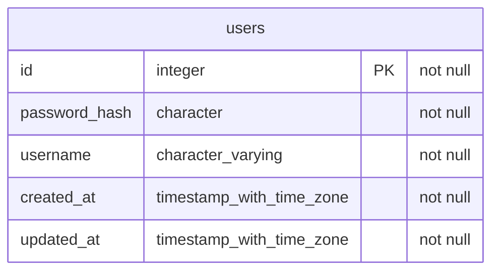

## Diagram

```mermaid
erDiagram

    users {
        id integer PK "not null"
        password_hash character "not null"
        username character_varying "not null"
        created_at timestamp_with_time_zone "not null"
        updated_at timestamp_with_time_zone "not null"
    }
```

## Indexes

### `users`

- `users_pkey`
- `users_username_key`
